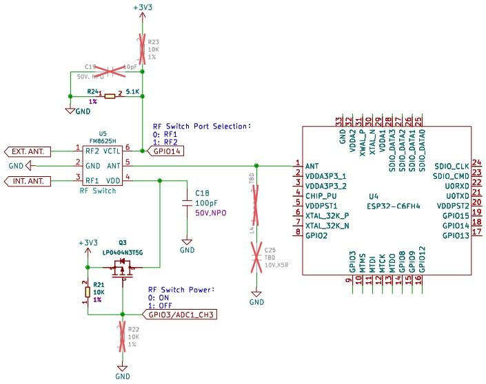
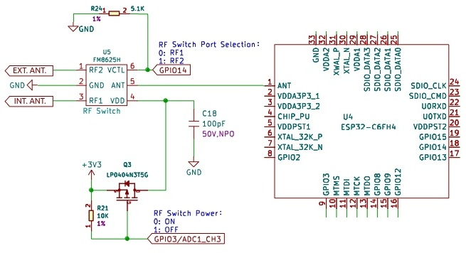
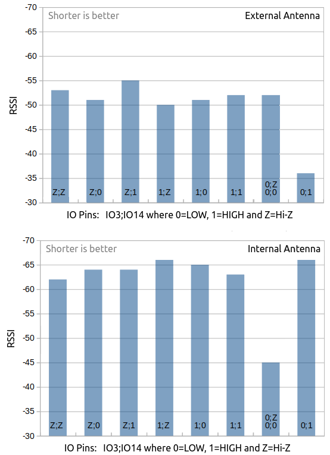

# XIAO ESP32C6 Antenna Selection

This is the antenna switching circuit of the XIAO ESP32C6.



Two ESP32-C6 I/O ports control U5 which is an RF (radio frequency) switch used to select either the on-board ceramic antenna or an external antenna connected to the U.FL coaxial connector. 

   1. GPIO3 enables the RF switch. Here, enabling the <a href="https://www.lcsc.com/datasheet/lcsc_datasheet_2109141830_Shenzhen-Fuman-Elec-FM8625H_C2857391.pdf" target="_blank">FM8625H</a> means powering it by grounding the gate of the <a href="https://www.lcsc.com/datasheet/lcsc_datasheet_1811071612_LRC-LP0404N3T5G_C172433.pdf" target="_blank">MOSFET</a>. 

   2. GPIO14 selects which antenna is connected to the ESP32-C6 ANT port.
   
As Alfonso Accosta (fons) said, the schematic is <a href="https://forum.seeedstudio.com/t/xiao-esp32c6-switching-between-builtin-and-external-antenna/276374/2" target="_blank"><i>pretty confusing due to the crossed-out components</i></a>. I tried to make sense of the circuit starting with the assumption that the internal antenna should be selected by default.

  1. R23 is part of a voltage divider in combination with R24, which would apply 1.1 V to the VCTL line of the RF switch. That is neither HIGH or LOW and makes no sense, so I think that we can safely assume that R23 has indeed been removed.  Consequently VCTL is grounded through R24 meaning that internal antenna is selected (RF1 is routed to ANT). I/O pad 14 must be put into OUTPUT mode and set to HIGH to select the external antenna.

  2. At first blush, I would have argued that R22 was necessary because otherwise the RF switch is not enabled by default. After playing with the two I/O pins, observing the counter-intuitive behaviour described by Alfonso and reading  a <a href="https://forum.seeedstudio.com/t/xiao-esp32c6-switching-between-builtin-and-external-antenna/276374/7" target="_blank">comment</a> by msfujino, I became convinced that R22 has been removed as indicated. 

  3. There is no need to worry about the L4 inductance and C25 capacitor. They seem to be part of an impedance matching circuit, but I do think they are superfluous as there are two pi impedance matching networks between the RF1 and RF2 pins of the RF switch and the internal and external antennas. 

So this is what I believe is the cleaned-up circuit.



What's important is that the <i>hardware does not enable the RF switch by default</i>. If correct, then one would assume that wireless communication would not work at all, but it was possible to connect the XIAO with Wi-Fi, BLE and Zigbee. The explanation was the comment by msfujino: <i>I came to the conclusion that the ANT is never connected to either RF port and that the signal is leaking because it is not sufficiently isolated.</i>.

Both msfujino and fons talked of testing this hypothesis so I decided to do the same. The source code of my exploratory sketch is in the [xiao32c6_antenna](xiao32c6_antenna/) directory. 

The sketch is fundamentally very simple. A Wi-Fi scan was performed and the [received signal strength indicator](https://en.wikipedia.org/wiki/Received_signal_strength_indicator) value or RSSI for each found Wi-Fi network was recorded. The idea was to do this systematically to compare the RSSIs according to the state of the two I/O pads used to control the RF switch. Each of the I/O pad can be in one of three states:  
   1. in INPUT mode (sometimes called Hi-Z or high impedance)
   2. in OUTPUT mode with a LOW value (0 volts) 
   3. in OUTPUT mode with a HIGH value (3.3 volts)

Consequently there are 9 possible combinations to investigate. In addition, the sketch does an initial scan without modifying in any way the I/O pads in order to be able to identify their initial state. (I did that because I could not find a way to read the mode/direction registers and latched values in the ESP32 Arduino core for the RISC-V architecture). When running the test using the on-board antenna, there was no attached external antenna. A rod antenna (rubber-ducky like) was connected when testing the external antenna but in this case, the on-board antenna remained present.

The results obtained from four runs of the program are found in the [data](data/) subdirectory. The reader is free to run the tests or to look at the results I obtained to see if he or she interprets them as I have. But here is a figure that is quite eloquent. It shows the RSSI values for the SIGMDELNET access point (about 1 metre from the XIAO) in the first run of each of the nine tests. There should be 9 bars, but only 8 are shown because the 0;Z and  0;0 values were exactly the same. Since the 0;Z and 0;0 labels mean meaning GPIO3 is in OUTPUT mode with a LOW value in both cases and GPIO14 is in INPUT mode in the first case and in OUTPUT mode with a LOW value in the second case, this is a confirmation that R23 is absent and R24 acts a pull down resistor in my estimation.  



When reading the graph, remember that when *an RSSI value is represented in a negative form (e.g. -100), the closer the value is to 0, the stronger the received signal has been* ([Source](https://en.wikipedia.org/wiki/Received_signal_strength_indicator#In_802.11_implementations)). Consequently the **shorter columns indicate a higher signal strength**. Comparing the two graphs, the external antenna is always better than the on-board ceramic antenna *except* when the RF switch is enabled (the last two columns). When the RF switch is enabled, best result is obtained by selecting the actual antenna.

The recent release of version 3.0.4 of the ESP32 Arduino core added a `.../variants/XIAO_ESP32C6/variant.cpp` file with the following function.

```C
void initVariant(void) {
  pinMode(WIFI_ENABLE, OUTPUT);
  digitalWrite(WIFI_ENABLE, LOW);  //turn on this function

  pinMode(WIFI_ANT_CONFIG, OUTPUT);
  digitalWrite(WIFI_ANT_CONFIG, LOW);  //use built-in antenna, set HIGH to use external antenna
}
```

The RF switch is enabled in software which I think confirms that there is not R22 to pull the gate of the MOSFET to ground. By my estimation, the last two statements were not needed, but it may be a good idea to set `WIFI_ANT_CONFIG` (= GPIO14) in OUTPUT mode so that a single `digitalWrite(WIFI_ANT_CONFIG, HIGH)` would suffice to select the external antenna in a user sketch. And if one sets a pin in OUTPUT mode, it is probably best to set a value at the same time.
